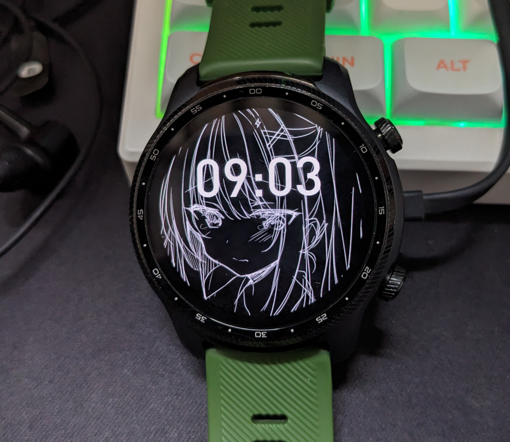

# TicWatch Pro X 使用记录

## 前言

实际上原本是写使用体验记录的

但是在2025年写一篇已经停产多年的手表有什么意义

故本篇会集中于手表的优化及一些方法

- 头图镇压

## 绑定APP常见问题

实际上你只需下载 Wear OS by Google APP 就能绑定手表了

> 版本号是类似 2.52.0.394110842.le 这类的 结尾带le的才能绑定 没带le是国际版的

出门问问APP的主要功能大致上为：查看检测数据 屏幕截图同步 esim绑定

其他功能要么死了要么没用

Wear OS by Google APP默认最新版就行

对于出门问问APP 目前能找到的安装包少之又少 且都含开屏广告

最新版定位地图无法显示 换旧版本即可

或者使用[出门问问网页版](https://h.chumenwenwen.com/)

## 常见耗电问题

应该没有人还在拿这手表来检测吧

这个检测功能已经很久没更新了

我是建议都关了 当一个纯纯的摸鱼神器

全部检测功能关了能提高一半的续航 但这还远远不够

你可以发现有些检测软件是能删除的

其中耗电最大的软件是 小问睡眠 （那很不意外了）

> 无法关闭检测 只能通过调整检测时间 删除软件不清楚能不能规避

然后续航基本能提高一个档次

以及目前的体验发现

使用 spotify for wearos 会比其他软件耗电量更低

甚至比离线歌单还低

2025/10/25 第一次修改
